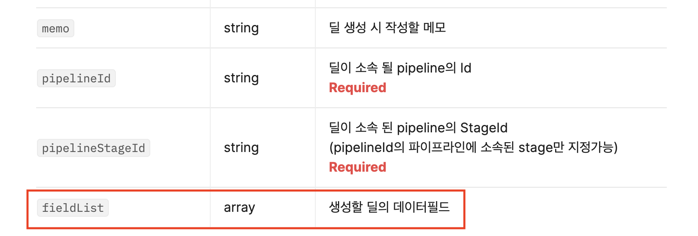

# fieldList

### fieldList와 데이터필드란?

* 데이터 필드를 지원하는 수정, 생성 API에는 fieldList라는 파라미터를 사용하여 데이터 유형에 맞게 데이터 필드의 내용을 수정, 생성할 수 있습니다.
* 데이터 필드의 데이터 유형은 세일즈맵의 회사 설정 - 데이터 관리 메뉴에서 확인할 수 있습니다.

<figure><figcaption>
세일즈맵의 회사 설정 / 데이터 필드 관리 메뉴에서 어떤 항목들이 어떤 데이터 필드를 지원하는지 확인할 수 있습니다.
</figcaption></figure>

* 예시) 딜 생성 API의 경우 생성할 딜의 데이터 필드를 fieldList를 활용하여 값을 생성할 수 있습니다.

<figure><figcaption>
딜 생성 API의 바디파라메터입니다. fieldList를 이용하여 세일즈맵에서 지원하는 데이터필드를 생성 / 수정 할 수 있습니다.
</figcaption></figure>

### 데이터 필드에 맞게 fieldList 작성하기

* 데이터 필드는 name과 \~value로 이뤄져 있는 object타입의 array 입니다. 각 필드의 데이터 유형에 따라 정확한 이름의 value를 입력해주셔야 합니다.
* 예시) 텍스트 유형의 데이터를 입력하고 싶은 경우 stringValue에 값을 입력해야합니다.

<figure><figcaption>
이메일이라는 이름의 텍스트 데이터 유형의 데이터필드를 수정/생성 하기 위해서는 데이터 필드의 이름과 유형에 따른 Value를 올바르게 입력해야 합니다.
</figcaption></figure>

<table><thead><tr><th width="187">데이터 필드 유형</th><th width="546">데이터 필드 앙식 예제 (요청 및 응답 예시)</th></tr></thead><tbody><tr><td>True / False</td><td>
{       "name" : "필드 이름",

      "booleanValue": true }
</td></tr><tr><td>날짜</td><td>
{       "name" : "필드 이름",

      "dateValue": "2024-04-16" }
</td></tr><tr><td>날짜 (시간)</td><td>
{       "name" : "필드 이름",

      "dateValue": "2024-04-16T07:18:17.516Z" }
</td></tr><tr><td>숫자</td><td>
{       "name" : "필드 이름",

      "numberValue": 12000 }
</td></tr><tr><td>텍스트</td><td>
{       "name" : "필드 이름",

      "stringValue": "텍스트 입력" }
</td></tr><tr><td>단일 선택</td><td>
{       "name" : "필드 이름",

      "stringValue": "선택지1" }
</td></tr><tr><td>복수 선택</td><td>
{       "name" : "필드 이름",

      "stringValueList": ["선택지1", "선택지3", "선택지4"] }
</td></tr><tr><td>회사 (단일)</td><td>
{       "name" : "필드 이름",

      "organizationValueId": "&#x3C;organizationId>" }
</td></tr><tr><td>회사 (복수)</td><td>
{       "name" : "필드 이름",

      "organizationValueIdList": [

                   "&#x3C;organizationId1>", 

                   "&#x3C;organizationId2>", 

                   "&#x3C;organizationId3>"

       ] }
</td></tr><tr><td>고객 (단일)</td><td>
{       "name" : "필드 이름",

      "peopleValueId": "&#x3C;peopleId>" }
</td></tr><tr><td>고객 (복수)</td><td>
{       "name" : "필드 이름",

      "peopleValueIdList": [

                   "&#x3C;peopleId1>", 

                   "&#x3C;peopleId2>" 

       ] }
</td></tr><tr><td>사용자 (단일)</td><td>
{       "name" : "필드 이름",

      "userValueId": "&#x3C;userId>" }
</td></tr><tr><td>사용자 (복수)</td><td>
{       "name" : "필드 이름",

      "userValueIdList": [

                   "&#x3C;userId1>",

                   "&#x3C;userId2>",

                   "&#x3C;userId3>"

       ] }
</td></tr><tr><td>파이프라인</td><td>
{       "name" : "필드 이름",

      "pipelineValueId": "&#x3C;pipelineId>" }  *파이프라인 및 파이프라인 단계는 요청 형식이 상이합니다(딜, 리드 생성 탭 확인)
</td></tr><tr><td>파이프라인 단계</td><td>
{       "name" : "필드 이름",

      "pipelineStageValueId": "&#x3C;pipelineStageId>" }  *파이프라인 및 파이프라인 단계는 요청 형식이 상이합니다(딜, 리드 생성 탭 확인)
</td></tr><tr><td>웹 폼 (단일)</td><td>
{       "name" : "필드 이름",

      "webformValueId": "&#x3C;webformId>" }
</td></tr><tr><td>시퀀스 (단일)</td><td>
{       "name" : "필드 이름",

      "sequenceValueId": "&#x3C;sequenceId>" }
</td></tr><tr><td>시퀀스 (복수)</td><td>
{       "name" : "필드 이름",

      "sequenceValueIdList": [

                   "&#x3C;sequenceId1>", 

                   "&#x3C;sequenceId2>", 

                   "&#x3C;sequenceId3>"

       ] }
</td></tr></tbody></table>

